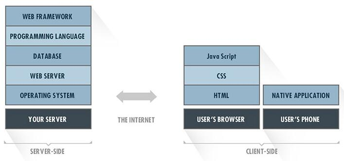

# Full Stack Technology

A tech stack is a combination of software products and programming languages used to create a web or mobile application. Applications have two software components: client-side and server-side, also known as front-end and back-end.

[Web Developer Roadmap 2018](https://github.com/kamranahmedse/developer-roadmap)
[Curated list of awesome lists, developer](Curated list of awesome lists)

## Front End

- [Javascript](https://github.com/EtachGu/Full-Stack-tutorial/tree/master/frontend/#javascript)
- [UI](https://github.com/EtachGu/Full-Stack-tutorial/tree/master/frontend/#ui)
- [CSS](https://github.com/EtachGu/Full-Stack-tutorial/tree/master/frontend/#css)
- [HTML](https://github.com/EtachGu/Full-Stack-tutorial/tree/master/frontend/#html)
- [Angluar](https://github.com/EtachGu/Full-Stack-tutorial/tree/master/frontend/#angluar)
- [React](https://github.com/EtachGu/Full-Stack-tutorial/tree/master/frontend/#react)
- [Vue](https://github.com/EtachGu/Full-Stack-tutorial/tree/master/frontend/#vue)
- [Node](https://github.com/EtachGu/Full-Stack-tutorial/tree/master/frontend/#node)
- [Gulp](https://github.com/EtachGu/Full-Stack-tutorial/tree/master/frontend/#gulp)
- [其他](https://github.com/EtachGu/Full-Stack-tutorial/tree/master/frontend#%E5%85%B6%E4%BB%96)
- [分享](https://github.com/EtachGu/Full-Stack-tutorial/tree/master/frontend#%E5%88%86%E4%BA%AB%E5%8A%9F%E8%83%BD)
- [在线演示](https://github.com/EtachGu/Full-Stack-tutorial/tree/master/frontend#%E5%9C%A8%E7%BA%BF%E6%BC%94%E7%A4%BA)
- [富文本编辑](https://github.com/EtachGu/Full-Stack-tutorial/tree/master/frontend#%E5%AF%8C%E6%96%87%E6%9C%AC%E7%BC%96%E8%BE%91%E5%99%A8)
- [Chrome](https://github.com/EtachGu/Full-Stack-tutorial/tree/master/rontend/#chrome)
- [性能优化](https://github.com/EtachGu/Full-Stack-tutorial/tree/master/frontend#%E6%80%A7%E8%83%BD%E4%BC%98%E5%8C%96)

## Back End

- [Node](https://github.com/EtachGu/Full-Stack-tutorial/tree/master/backend/#node)
- [Koa](https://github.com/EtachGu/Full-Stack-tutorial/tree/master/backend#koa)

- [Python](https://github.com/EtachGu/Full-Stack-tutorial/tree/master/backend#python)

- [Go](https://github.com/EtachGu/Full-Stack-tutorial/tree/master/backend/#go)

- [RESTful API](https://github.com/EtachGu/Full-Stack-tutorial/tree/master/backend#restful-api)

-[Authentication & authorization](https://github.com/EtachGu/Full-Stack-tutorial/tree/master/backend##authentication--authorization)

## DevOps

[DevOps](devops/README.md)