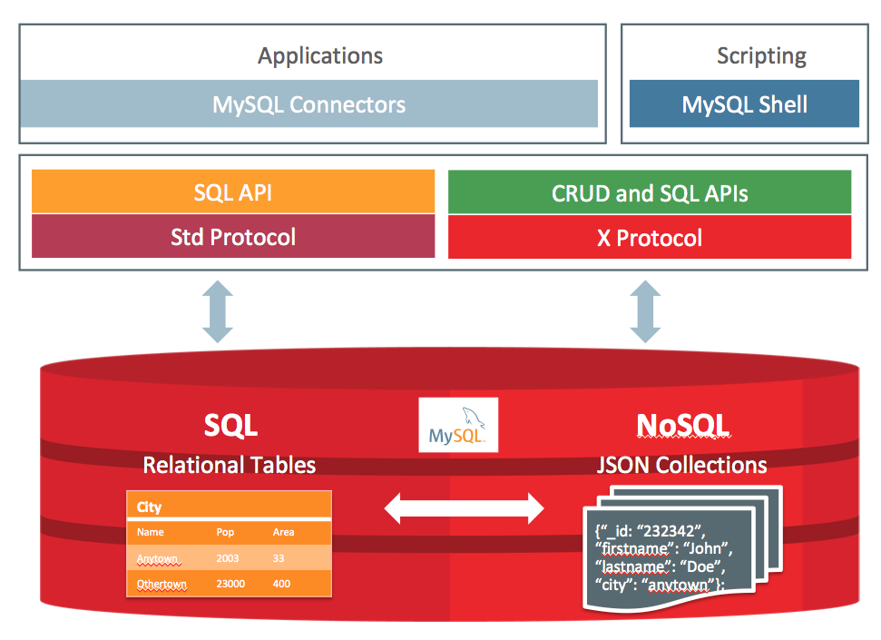
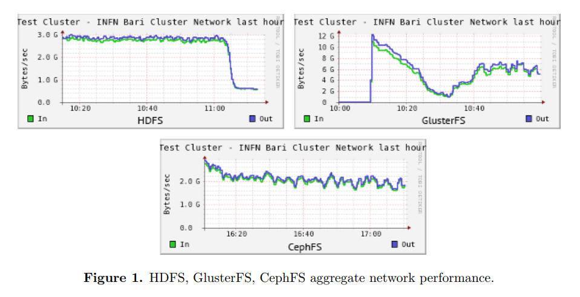

# Back End Technology

|               | [Node](#node) ([deno](https://github.com/ry/deno)) | [Go](#go)          | [Python](#python)  | [Java](#java)      |
| ------------- | -------------------------------------------------- | ------------------ | ------------------ | ------------------ |
| Multi-Threads | :heavy_check_mark:                                 | :heavy_check_mark: | :heavy_check_mark: | :heavy_check_mark: |
| When to use   |

-   [Back End Technology](#back-end-technology)
    -   [Architecture knowledge](#architecture-knowledge)
    -   [Node](#node)
        -   [Koa](#koa)
    -   [Go language](#go-language)
    -   [Python](#python)
    -   [Java](#java)
    -   [RESTful API](#restful-api)
    -   [Authentication & authorization](#authentication--authorization)
    -   [Lua](#lua)
    -   [Microservices Architecture 微服务](#microservices-architecture-%E5%BE%AE%E6%9C%8D%E5%8A%A1)
        -   [12 Factors](#12-factors)
    -   [Load/Stree Test](#loadstree-test)
    -   [Theory fo distributed system](#theory-fo-distributed-system)
    -   [Database](#database)
    -   [Caching](#caching)
    -   [Desgin Pattern 23 种设计模式](#desgin-pattern-23%E7%A7%8D%E8%AE%BE%E8%AE%A1%E6%A8%A1%E5%BC%8F)
        -   [创建型](#%E5%88%9B%E5%BB%BA%E5%9E%8B)
        -   [结构型](#%E7%BB%93%E6%9E%84%E5%9E%8B)
        -   [行为模式](#%E8%A1%8C%E4%B8%BA%E6%A8%A1%E5%BC%8F)
    -   [FMEA(Failure mode and effects analysis) 故障模式与影响分析](#fmeafailure-mode-and-effects-analysis-%E6%95%85%E9%9A%9C%E6%A8%A1%E5%BC%8F%E4%B8%8E%E5%BD%B1%E5%93%8D%E5%88%86%E6%9E%90)
    -   [Search](#search)
    -   [File System](#file-systemserver)
    -   [Network](#network)
    -   [Middleware](#middleware%E4%B8%AD%E9%97%B4%E4%BB%B6)

## Architecture knowledge

[architect-awesome](https://github.com/xingshaocheng/architect-awesome)

## Node

---

| Node                                                                                        | Article                                                                                 |
| ------------------------------------------------------------------------------------------- | --------------------------------------------------------------------------------------- |
| [node 技巧](https://github.com/Wscats/Good-text-Share/issues/44)                            | [NodeJs 静态服务器](https://github.com/Wscats/angular-demo/tree/gh-pages/diyNodeServer) |
| **Reference**                                                                               | **Reference**                                                                           |
| [Node.js 包教不包会](https://github.com/alsotang/node-lessons)                              | [七天学会 NodeJS](http://nqdeng.github.io/7-days-nodejs/)                               |
| [从零开始 nodejs 系列文章](http://blog.fens.me/series-nodejs)                               | [Node 入门](http://www.nodebeginner.org/index-zh-cn.html)                               |
| [Node 初学者入门，一本全面的 NodeJS 教程](http://ourjs.com/detail/529ca5950cb6498814000005) |

### Koa

next generation web framework for node.js
[Koa](https://github.com/koajs)

[koa middleware](https://github.com/koajs/koa/wiki)

## Go language

---

| Article                                             | Article |
| --------------------------------------------------- | ------- |
| [Go Books](https://github.com/dariubs/GoBooks)      |
| [awesome-go](https://github.com/avelino/awesome-go) |
| [Go kit](https://github.com/go-kit/kit)             |

## [Python](https://www.python.org)

---

| Article                                                                       | Article                                                                                 |
| ----------------------------------------------------------------------------- | --------------------------------------------------------------------------------------- |
| [awesome-python](https://github.com/vinta/awesome-python)                     |
| [Web 框架 Django](https://github.com/django/django)                           | [Django rest framework ](http://www.django-rest-framework.org/)                         |
| [django-debug-toolbar](https://github.com/jazzband/django-debug-toolbar/)     | [django db optimization](https://docs.djangoproject.com/en/2.0/topics/db/optimization/) |
| [Flask](http://flask.pocoo.org/)                                              |
| [Full Stack Python ](https://www.fullstackpython.com)                         | [microservices](https://www.fullstackpython.com/microservices.html)                     |
| [Pika RabbitMQ](https://github.com/pika/pika)                                 |
| [Green python Color, also for Djnago Test](https://github.com/CleanCut/green) |

**[Celery](http://docs.celeryproject.org/en/latest/index.html)**
is a task queue with focus on real-time processing, while also supporting task scheduling.

Why we need Task Queue in Web Context?

These are some common use cases:

-   Running something in the background. For example, to finish the web request as soon as possible, then update the users page incrementally. This gives the user the impression of good performance and “snappiness”, even though the real work might actually take some time.
-   Running something after the web request has finished.
-   Making sure something is done, by executing it asynchronously and using retries.
-   Scheduling periodic work.

| tool                                      |
| ----------------------------------------- |
| [virtualenv](https://virtualenv.pypa.io/) |

## Java

---

[Java Spring](https://spring.io/)

[Spring boot 优缺点](https://www.zhihu.com/question/39483566)

[Netlfix Eureka](https://github.com/Netflix/eureka) is a REST (Representational State Transfer) based service that is primarily used in the AWS cloud for locating services for the purpose of load balancing and failover of middle-tier servers

[spring cloud netflix](https://github.com/spring-cloud/spring-cloud-netflix)
Service Discovery (Eureka), Circuit Breaker (Hystrix), Intelligent Routing (Zuul) and Client Side Load Balancing (Ribbon)

[DTO VO POJO JavaBean](https://stackoverflow.com/questions/1612334/difference-between-dto-vo-pojo-javabeans)

[**Sample** Rest.js and Spring Data REST ](https://spring.io/guides/tutorials/react-and-spring-data-rest/)

[Playframework is based on a lightweight, stateless, web-friendly architecture](https://github.com/playframework/playframework)
|tool|
[Maven](https://maven.apache.org/what-is-maven.html) is a tool that can now be used for building and managing any Java-based project.
[Google guava](https://github.com/google/guava) is a set of core libraries that includes new collection types (such as multimap and multiset), immutable collections, a graph library, functional types, an in-memory cache, and APIs/utilities for concurrency, I/O, hashing, primitives, reflection, string processing, and much more!

Netlfix Hystrix 限流熔断，

[Alibaba Java Coding Guidelines pmd implements and IDE plugin](https://github.com/alibaba/p3c)

[Learning Java](https://www.youtube.com/user/java/)
[Spring Framework Transaction Management](https://docs.spring.io/spring/docs/5.1.4.RELEASE/spring-framework-reference/data-access.html#transaction)
[分布式事务](https://mp.weixin.qq.com/s/43wwC4lp77m4foVPEgTRlA)
[TCC Transaction](https://github.com/changmingxie/tcc-transaction)

## RESTful API

[Best practies for a pragmatic RESTful API](https://www.vinaysahni.com/best-practices-for-a-pragmatic-restful-api)

[HTTP API Design](https://github.com/interagent/http-api-design)

[OpenAPI](https://github.com/OAI/OpenAPI-Specification/blob/master/versions/3.0.0.md)

[RESTful API design](https://github.com/aisuhua/restful-api-design-references)

[RESTful API introductions](https://idratherbewriting.com/learnapidoc/index.html)

[HATEOAS ( Hypermedia as Engine of Application State)](https://en.wikipedia.org/wiki/HATEOAS)

[Microsoft RESTful API guidelines](https://github.com/Microsoft/api-guidelines)

[API Style book](http://apistylebook.com/design/guidelines/)

[REST Resource Naming Guide](https://www.javadevjournal.com/spring/rest-resource-naming/)

API Design Tool
1. [Swagger Editor](http://editor.swagger.io/)
2. [Swagger Codegen](https://github.com/swagger-api/swagger-codegen)

## Authentication & authorization

SAML
[SAML Security Assertion Markup Language](https://en.wikipedia.org/wiki/Security_Assertion_Markup_Language)
is an open standard that allows identity providers (IdP) to pass authorization credentials to service providers (SP).

OAuth
[OAuth 2](https://oauth.net/2/)

[SSO how does single-sign-on work](https://auth0.com/blog/what-is-and-how-does-single-sign-on-work/)

[Spring Security OAuth2 SSO](https://docs.spring.io/spring-security-oauth2-boot/docs/current/reference/html/boot-features-security-oauth2-single-sign-on.html)

[CAS (Central Authentication Service)](https://github.com/apereo/cas)

[CAS SSO](https://apereo.github.io/cas/4.2.x/planning/Architecture.html)
[CAS Install tutorial video](https://www.youtube.com/watch?v=RaWHNChzwaU)
[CAS War Overlayer](https://github.com/apereo/cas-overlay-template)

Basic

tokn

JWT(JSON Web Token) https://jwt.io/

OpenID https://openid.net

Spring Security Domain Object Security (ACLs)
https://www.concretepage.com/spring/spring-security/

LDAP [OpenLDAP](http://www.zytrax.com/books/ldap/)
LDAP is often used by organizations as a central repository for user information and as an authentication service. It can also be used to store the role information for application users.

IAM (identity and access management)
all forms of access control can ultimately be mapped back to one of four classic models:

-   Discretionary Access Control (DAC),
-   Mandatory Access Control (MAC),
-   Role-based Access Control (RBAC),
-   Attribute-based Access Control (ABAC)

http://blog.identityautomation.com/rbac-vs-abac-access-control-models-iam-explained

| Article                                                                                                                                            |
| -------------------------------------------------------------------------------------------------------------------------------------------------- |
| [Four Authentication & authorization ](https://blog.csdn.net/gdp12315_gu/article/details/79905424)                                                 |
| [Entity-level access restriction in the microservice architecture based on user or group membership](https://stackoverflow.com/a/48021163/6497118) |

| OpenSource                                                                                                                                        |
| ------------------------------------------------------------------------------------------------------------------------------------------------- |
| [Keycloak an open source Identity and Access Management solution](https://github.com/keycloak/keycloak)                                           |
| [An OpenID Connect reference implementation in Java on the Spring platform](https://github.com/mitreid-connect/OpenID-Connect-Java-Spring-Server) |

[OAuth2 good and bad](https://code.tutsplus.com/articles/oauth-20-the-good-the-bad-the-ugly--net-33216)

[OAuth2 vs OpenID Connect vs SAML](https://www.gluu.org/blog/oauth-vs-saml-vs-openid-connect/)

## Lua

[kong](https://github.com/Kong/kong)基于 OpenResty 的 API 网关服务和网关服务管理层.

## Microservices Architecture 微服务

-   [What is microservice](https://martinfowler.com/articles/microservices.html)
-   [《微服务：从设计到部署》中文版](https://legacy.gitbook.com/book/docshome/microservices/details)

Tools for Microservices

| 名称 | 说明 |
|---|---|
|[API Fortress](https://apifortress.com/)|API 测试和健康检测工具，为企业级 API 提供自动化的功能测试、健康检测和负载测试。它的设计原则是无代码，完全基于现代 API 架构实践和模式而构建 **收费**|
|[Graylog](https://www.graylog.org/)|Security Incident and Event Management Report|
|[Istio](https://github.com/istio/istio)|它支持在 Kubernetes 上进行服务部署，其服务网格技术为微服务通信带来了可靠性、安全性和可管理性。其中，服务网格技术可以用于改善应用程序和微服务之间的关系和交互。**开源**|
|[Conductor](https://netflix.github.io/conductor/)|Netflix 的微服务编排引擎，是 Netflix OSS 生态系统的一部分。它可以运行在云端，并实现了微服务的流程编配。它还能够用于控制和可视化微服务之间的交互。|
|[Seneca](https://github.com/senecajs/seneca)|开发人员可以使用 Seneca，来轻松构建基于消息的微服务，它是 Node.js 的微服务工具包，可以用它写出干净而且结构良好的代码，并系统化应用程序的业务逻辑。|
|[Elixir](https://elixir-lang.org/)|Elixir is a dynamic, functional language designed for building scalable and maintainable applications.|

[PiggyMetrics This is a proof-of-concept application, which demonstrates Microservice Architecture Pattern using Spring Boot, Spring Cloud and Docker. With a pretty neat user interface, by the way.](https://github.com/sqshq/PiggyMetrics)

[Staffjoy V2 ](https://github.com/Staffjoy/v2)

### [12 Factors](https://12factor.net/)

The factors represent a set of guidelines or best practices for portable, resilient applications that will thrive in cloud environments(specifically software as a service applications)

1. There should be a one-to-one association between a versioned codebase (for example,an IT repository) and a deployed service. The same codebase is used for many deployments.
2. Services should explicitly declare all dependencies, and should not rely on the presence of system-level tools or libraries.
3. Configuration that varies between deployment environments should be stored in the environment (specifically in environment variables).
4. All backing services are treated as attached resources, which are managed (attached and detached) by the execution environment.
5. The delivery pipeline should have strictly separate stages: Build, release, and run.
6. Applications should be deployed as one or more stateless processes. Specifically, transient processes must be stateless and share nothing. Persisted data should be stored in an appropriate backing service.
7. Self-contained services should make themselves available to other services by listening on a specified port.
8. Concurrency is achieved by scaling individual processes (horizontal scaling).
9. Processes must be disposable: Fast startup and graceful shutdown behaviors lead to a more robust and resilient system.
10. All environments, from local development to production, should be as similar as possible.
11. Applications should produce logs as event streams (for example, writing to stdout and stderr), and trust the execution environment to aggregate streams.
12. If admin tasks are needed, they should be kept in source control and packaged alongside the application to ensure that it is run with the same environment as the application.

## Load/Stree Test

| Load/Stress Test                                                                               |
| ---------------------------------------------------------------------------------------------- |
| [ab - Apache HTTP server benchmarking tool](http://httpd.apache.org/docs/2.0/programs/ab.html) |
| [Apache JMeter](http://jmeter.apache.org/)                                                     |
| [Siege](http://freshmeat.sourceforge.net/projects/siege/)                                      |
| [FunkLoad](http://funkload.nuxeo.org/#)                                                        |
| [loader.io](https://loader.io/)                                                                |
| [Gatling](https://gatling.io/)                                                                 |

## Theory fo distributed system

-   [CAP 定理（CAP theorem, Consistency, Availability, Partition tolerance）](https://en.wikipedia.org/wiki/CAP_theorem)
-   [Distributed Systems for fun and profit](http://book.mixu.net/distsys/)
-   [8 fallacies of distributed computing](https://en.wikipedia.org/wiki/Fallacies_of_distributed_computing)
-   [FLP 不可能性的](https://groups.csail.mit.edu/tds/papers/Lynch/jacm85.pdf)
- [**Raft** A Consensus Algorithm](https://raft.github.io/raft.pdf) [visualization of Raft](http://thesecretlivesofdata.com/raft/)

Soft
- [Apache Mesos](http://mesos.apache.org/)

## Database

|                     | Oracle             | Postgresql                                                                                                   | Mysql                                                                                         | SQLite                                                                            |
| ------------------- | ------------------ | ------------------------------------------------------------------------------------------------------------ | --------------------------------------------------------------------------------------------- | --------------------------------------------------------------------------------- |
| Introduction        |                    |                                                                                                              |                                                                                               | A very powerful, embedded relational database management system                   |
| Relational Database | :heavy_check_mark: | :heavy_check_mark:                                                                                           | :heavy_check_mark:                                                                            | :heavy_check_mark:                                                                |
| Advantage           |                    | An open-source SQL standard compliant RDBMS,Strong community,Strong third-party support,Extensible,Objective | Easy to work,Feature rich,Secure, Scalabel, Speedy                                            | File based, Standards-aware                                                       |
| Disadvantage        |                    | Performance,Hosting                                                                                          | Function limitations, Reliability issues, Stagnated development                               | No user management, Lack of possibility to tinker with for additional performance |
| When to use         |                    | Data Integrity, Complex custom procedures,Integration,complex design                                         | Distributed operations, Hight security,Web site or Web app, Custom solution                   | Embedded app, Disk access replacement, Testing                                    |
| When not to use     |                    | Speed,Simple set ups,Replication                                                                             | [SQL Compliance](https://en.wikipedia.org/wiki/SQL_compliance), Concurrency, Full-text search | Multi-User App, High write volumes                                                |

| postgresql                                             |
| ------------------------------------------------------ |
| [postgresql](https://www.postgresql.org/)              |
| [pgAdmin GUI for Postgresql](https://www.pgadmin.org/) |

| MySQL                                                                                                  |
| ------------------------------------------------------------------------------------------------------ |
| [MySQL8.0 new feature 支持文档存储](https://www.mysql.com/why-mysql/white-papers/whats-new-mysql-8-0/) |

[] ArangoDB](https://www.arangodb.com/why-arangodb/)

reference:
[1]https://www.digitalocean.com/community/tutorials/sqlite-vs-mysql-vs-postgresql-a-comparison-of-relational-database-management-systems

## Database migrations / version

[flyway](https://flywaydb.org/getstarted/how)

[liquibase](https://www.liquibase.org/)

https://stackoverflow.com/questions/115369/do-you-use-source-control-for-your-database-items?page=1&tab=votes#tab-top

[Apache Ignite](https://apacheignite.readme.io/docs/what-is-ignite)

## Persistence Framework

[MyBatis](http://www.mybatis.org/mybatis-3/) is a first class persistence framework with support for custom SQL, stored procedures and advanced mappings.
[MyBatis Web Example](https://github.com/mybatis/jpetstore-6/releases)

[Hibernate ORM](http://hibernate.org/)

## Caching

[Memcached VS Redis](https://stackoverflow.com/questions/10558465/memcached-vs-redis)

[System Properties Comparison Memcached vs. Redis](https://db-engines.com/en/system/Memcached%3BRedis)

Redis is better than Memcache

[Redis 中文网](http://www.redis.net.cn/tutorial/3502.html)

缓存设计的要点 1.缓存穿透，避免缓存穿透 2.缓存雪崩，加锁或者后台更新 3.缓存热点，备份 多副本

## Desgin Pattern 23 种设计模式

### 创建型

-   Abstract Factory 抽象工厂
-   Builder 构建器
-   Factory Method 工厂方法
-   Prototype 原型
-   Singleton 单例

### 结构型

-   Adapter 适配器
-   Bridge 桥接
-   Composite 组合
-   Decorator 装饰器
-   Facade 外观模式
-   Flyweight 享元模式
-   Proxy 代理

### 行为模式

-   Chain of Responsiblity 责任链
-   Command 命令
-   Iterpreter 解释器
-   Iterator 迭代器
-   Mediator 中介者
-   Memento 备忘录
-   Observer 观察者
-   State 状态
-   Strategy 策略
-   Template Method 模板方法
-   Visitor 访问者

## FMEA(Failure mode and effects analysis) 故障模式与影响分析

又称失效模式与后果分析、失效模式与效应分析、故障模式与后果分析等。

1. 找出产品或过程中潜在的故障模式
2. 根据相应的评价体系对找出的潜在故障模式进行风险量化评估
3. 列出故障的起因/机理，寻找预防或改进措施

## Search

ElasticSearch
https://www.elastic.co/guide/en/elasticsearch/reference/current/_basic_concepts.html

Apache Solr

Sphinx

Apache lucene

## Netty

https://mp.weixin.qq.com/s/FUHnDFiHWeJC1J6-jAh9mA

## File System/Server

Based On HBase

Small File Server

淘宝 TFS、京东 JFS、Facebook 的 Haystack

| Client                                     | Written in | License                                     | Access API                                                                |
| ------------------------------------------ | ---------- | ------------------------------------------- | ------------------------------------------------------------------------- |
| Ceph                                       | C++        | LGPL                                        | librados (C, C++, Python, Ruby), S3, Swift, FUSE                          |
| BeeGFS                                     | C / C++    | FRAUNHOFER FS (FhGFS) EULA,[1] GPLv2 client | POSIX                                                                     |
| [GlusterFS](https://www.gluster.org/)      | C          | GPLv3                                       | libglusterfs, FUSE, NFS, SMB, Swift, libgfapi                             |
| [MooseFS](https://moosefs.com/)            | C          | GPLv2                                       | POSIX, FUSE                                                               |
| Quantcast File System                      | C          | Apache License 2.0                          | C++ client, FUSE (C++ server: MetaServer and ChunkServer are both in C++) |
| Spectrum Scale (GPFS)                      | C, C++     | Proprietary                                 | POSIX, NFS, SMB, Swift                                                    |
| [Lustre](http://wiki.lustre.org/Main_Page) | C          | GPLv2                                       | POSIX, liblustre, FUSE                                                    |
| MapR-FS                                    | C, C++     | Proprietary                                 | POSIX, NFS, FUSE, S3                                                      |
| OpenAFS                                    | C          | IBM Public License                          | Virtual file system, Installable File System                              |
| scality                                    | C          | Proprietary                                 | fuse, NFS file system, rest, AWS S3                                       |
| Tahoe-LAFS                                 | Python     | GNU GPL 2+ and other[5]                     | HTTP (browser or CLI), SFTP, FTP, FUSE via SSHFS, pyfilesystem            |
| HDFS                                       | Java       | Apache License 2.0                          | Java and C client, HTTP                                                   |
| XtreemFS                                   | Java, C++  | BSD License                                 | libxtreemfs (Java, C++), FUSE                                             |
| Ori[6]                                     | C, C++     | MIT                                         | libori, FUSE                                                              |

[reference Wiki](https://en.wikipedia.org/wiki/Comparison_of_distributed_file_systems)

HDFS vs Ceph vs GlusterFS

http://iopscience.iop.org/article/10.1088/1742-6596/513/4/042014/pdf

MooseFS 适合大中文件

[NAS, SAN, NFS, 块存储、文件存储、对象存储](https://blog.csdn.net/gdp12315_gu/article/details/87996037)

## Network

[Wireshark ](https://www.wireshark.org/) is the world’s foremost and widely-used network protocol analyzer.

[RawCap](https://www.netresec.com/?page=RawCap) is a free command line network sniffer for Windows that uses raw sockets.

[C10K Problem](http://www.kegel.com/c10k.html#top)
[C10K Problem翻译](https://www.oschina.net/translate/c10k?lang=chs&p=1)
http://highscalability.com/blog/2013/5/13/the-secret-to-10-million-concurrent-connections-the-kernel-i.html

## Middleware/中间件

[Nginx](http://nginx.org/) is an open source web server and reverse proxy
Load_balancing (http://nginx.org/en/docs/http/load_balancing.html)

[kong](https://github.com/Kong/kong)基于 OpenResty 的 API 网关服务和网关服务管理层.

[Netflix Eureka 深度剖析服务注册与发现原理](https://zhuanlan.zhihu.com/p/24829766)

[Prometheus Power your metrics and alerting with a leading open-source monitoring solution](https://prometheus.io/)
[Learning Prometheus](https://github.com/yunlzheng/prometheus-book)

## Logging Management

SLF4J 

[Logback](https://logback.qos.ch/documentation.html)

ELK(Elasticsearch Logstash Kibana) a Centralized Logging stack.

[fluentd Open-Source Log Collector ](https://github.com/fluent/fluentd)

a better conceptual model is to treat **logs as time-ordered streams**: there is no beginning or end, but rather an ongoing, collated collection of events which we may wish to view in realtime as they happen (e.g. via tail -f or heroku logs --tail) or which we may wish to search in some time window (e.g. via grep or Splunk).

## IoT (Interet of Thing)

[MQTT is a machine-to-machine (M2M)/"Internet of Things" connectivity protocol](http://mqtt.org/)