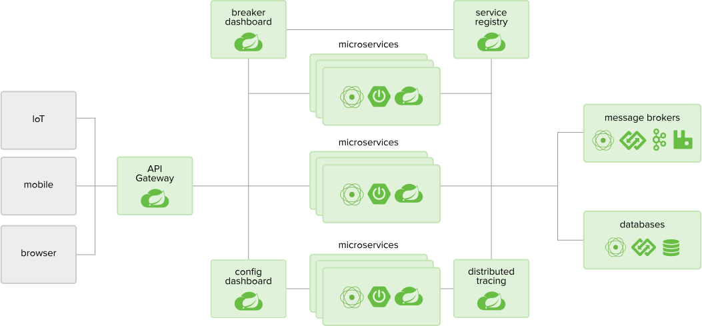

# Back End Technology

|               | [Node](#node) ([deno](https://github.com/ry/deno))      | [Go](#go)          | [Python](#python)  | [Java](#java)      |
| ------------- | ------------------ | ------------------ | ------------------ | ------------------ |
| Multi-Threads | :heavy_check_mark: | :heavy_check_mark: | :heavy_check_mark: | :heavy_check_mark: |

- [Back End Technology](#back-end-technology)
    - [Architecture knowledge](#architecture-knowledge)
    - [Node](#node)
        - [Koa](#koa)
    - [Go language](#go-language)
    - [Python](#pythonhttps---wwwpythonorg)
    - [Java](#java)
    - [RESTful API](#restful-api)
    - [Authentication & authorization](#authentication-authorization)
    - [Lua](#lua)
    - [Microservices Architecture 微服务](#microservices-architecture)
    - [Load/Stree Test](#load-stree-test)
    - [Theory fo distributed system](#theory-fo-distributed-system)
    - [Database](#database)

## Architecture knowledge

[architect-awesome](https://github.com/xingshaocheng/architect-awesome)

## Node
----
| Node                                                                                     | Article                                                                                |
| ---------------------------------------------------------------------------------------- | -------------------------------------------------------------------------------------- |
| [node技巧](https://github.com/Wscats/Good-text-Share/issues/44)                          | [NodeJs静态服务器](https://github.com/Wscats/angular-demo/tree/gh-pages/diyNodeServer) |
| **Reference**                                                                            | **Reference**                                                                          |
| [Node.js 包教不包会](https://github.com/alsotang/node-lessons)                           | [七天学会NodeJS](http://nqdeng.github.io/7-days-nodejs/)                               |
| [从零开始nodejs系列文章](http://blog.fens.me/series-nodejs)                              | [Node入门](http://www.nodebeginner.org/index-zh-cn.html)                               |
| [Node初学者入门，一本全面的NodeJS教程](http://ourjs.com/detail/529ca5950cb6498814000005) |

###  Koa
next generation web framework for node.js
[Koa](https://github.com/koajs)
[koa middleware](https://github.com/koajs/koa/wiki)

## Go language
----
| Article                                             | Article |
| --------------------------------------------------- | ------- |
| [Go Books](https://github.com/dariubs/GoBooks)      |
| [awesome-go](https://github.com/avelino/awesome-go) |
| [Go kit](https://github.com/go-kit/kit)             |

## [Python](https://www.python.org)
-----
| Article                                                                       | Article                                                                                 |
| ----------------------------------------------------------------------------- | --------------------------------------------------------------------------------------- |
| [awesome-python](https://github.com/vinta/awesome-python)                     |
| [Web 框架 Django](https://github.com/django/django)                           | [Django rest framework ](http://www.django-rest-framework.org/)                         |
| [django-debug-toolbar](https://github.com/jazzband/django-debug-toolbar/)     | [django db optimization](https://docs.djangoproject.com/en/2.0/topics/db/optimization/) |
| [Flask](http://flask.pocoo.org/)                                              |
| [Full Stack Python ](https://www.fullstackpython.com)                         | [microservices](https://www.fullstackpython.com/microservices.html)                     |
| [Pika RabbitMQ](https://github.com/pika/pika)                                 |
| [Green python Color, also for Djnago Test](https://github.com/CleanCut/green) |

**[Celery](http://docs.celeryproject.org/en/latest/index.html)**
is a task queue with focus on real-time processing, while also supporting task scheduling.

Why we need Task Queue in Web Context?

These are some common use cases:

- Running something in the background. For example, to finish the web request as soon as possible, then update the users page incrementally. This gives the user the impression of good performance and “snappiness”, even though the real work might actually take some time.
- Running something after the web request has finished.
- Making sure something is done, by executing it asynchronously and using retries.
- Scheduling periodic work.

| tool                                      |
| ----------------------------------------- |
| [virtualenv](https://virtualenv.pypa.io/) |

## Java
---

[Java Spring](https://spring.io/)
[Spring boot优缺点](https://www.zhihu.com/question/39483566)
[Netlfix Eureka](https://github.com/Netflix/eureka) is a REST (Representational State Transfer) based service that is primarily used in the AWS cloud for locating services for the purpose of load balancing and failover of middle-tier servers

[spring cloud netflix](https://github.com/spring-cloud/spring-cloud-netflix)
Service Discovery (Eureka), Circuit Breaker (Hystrix), Intelligent Routing (Zuul) and Client Side Load Balancing (Ribbon)

[DTO VO POJO JavaBean](https://stackoverflow.com/questions/1612334/difference-between-dto-vo-pojo-javabeans)

[**Sample** Rest.js and Spring Data REST ](https://spring.io/guides/tutorials/react-and-spring-data-rest/)

[Playframework is based on a lightweight, stateless, web-friendly architecture](https://github.com/playframework/playframework)
|tool|
[Maven](https://maven.apache.org/what-is-maven.html) is a tool that can now be used for building and managing any Java-based project.
[Google guava](https://github.com/google/guava) is a set of core libraries that includes new collection types (such as multimap and multiset), immutable collections, a graph library, functional types, an in-memory cache, and APIs/utilities for concurrency, I/O, hashing, primitives, reflection, string processing, and much more!

## RESTful API

[OpenAPI](https://github.com/OAI/OpenAPI-Specification/blob/master/versions/3.0.0.md)

[RESTful API design](https://github.com/aisuhua/restful-api-design-references)

[RESTful API introductions](https://idratherbewriting.com/learnapidoc/index.html)

[HATEOAS ( Hypermedia as Engine of Application State)](https://en.wikipedia.org/wiki/HATEOAS)

## Authentication & authorization
OAuth
[OAuth 2](https://oauth.net/2/)

Basic 

tokn

JWT(JSON Web Token) https://jwt.io/

OpenID

|Article|
|---|
|[Four Authentication & authorization ](https://blog.csdn.net/gdp12315_gu/article/details/79905424)|

## Lua

[kong](https://github.com/Kong/kong)基于OpenResty的 API 网关服务和网关服务管理层.

## Microservices Architecture 微服务

- [What is microservice](https://martinfowler.com/articles/microservices.html)
- [《微服务：从设计到部署》中文版](https://legacy.gitbook.com/book/docshome/microservices/details)

## Load/Stree Test

|Load/Stress Test|
|---|
|[ab - Apache HTTP server benchmarking tool](http://httpd.apache.org/docs/2.0/programs/ab.html)|
|[Apache JMeter](http://jmeter.apache.org/)|
|[Siege](http://freshmeat.sourceforge.net/projects/siege/)|
|[FunkLoad](http://funkload.nuxeo.org/#)|
|[loader.io](https://loader.io/)|

## Theory fo distributed system

- [CAP定理（CAP theorem, Consistency, Availability, Partition tolerance）](https://en.wikipedia.org/wiki/CAP_theorem)
- [Distributed Systems for fun and profit](http://book.mixu.net/distsys/)
- [8 fallacies of distributed computing](https://en.wikipedia.org/wiki/Fallacies_of_distributed_computing)
- [FLP 不可能性的](https://groups.csail.mit.edu/tds/papers/Lynch/jacm85.pdf)

## Database

|                     | Oracle             | Postgresql                                                                                                   | Mysql                                                                                         | SQLite                                                                            |
| ------------------- | ------------------ | ------------------------------------------------------------------------------------------------------------ | --------------------------------------------------------------------------------------------- | --------------------------------------------------------------------------------- |
| Introduction        |                    |                                                                                                              |                                                                                               | A very powerful, embedded relational database management system                   |
| Relational Database | :heavy_check_mark: | :heavy_check_mark:                                                                                           | :heavy_check_mark:                                                                            | :heavy_check_mark:                                                                |
| Advantage           |                    | An open-source SQL standard compliant RDBMS,Strong community,Strong third-party support,Extensible,Objective | Easy to work,Feature rich,Secure, Scalabel, Speedy                                            | File based, Standards-aware                                                       |
| Disadvantage        |                    | Performance,Hosting                                                                                          | Function limitations, Reliability issues, Stagnated development                                                                                               | No user management, Lack of possibility to tinker with for additional performance |
| When to use         |                    | Data Integrity, Complex custom procedures,Integration,complex design                                         | Distributed operations, Hight security,Web site or Web app, Custom solution                   | Embedded app, Disk access replacement, Testing                                    |
| When not to use     |                    | Speed,Simple set ups,Replication                                                                             | [SQL Compliance](https://en.wikipedia.org/wiki/SQL_compliance), Concurrency, Full-text search | Multi-User App, High write volumes                                                |

|postgresql|
|---|
|[postgresql](https://www.postgresql.org/)|
|[pgAdmin GUI for Postgresql](https://www.pgadmin.org/)|

reference:
[1]https://www.digitalocean.com/community/tutorials/sqlite-vs-mysql-vs-postgresql-a-comparison-of-relational-database-management-systems