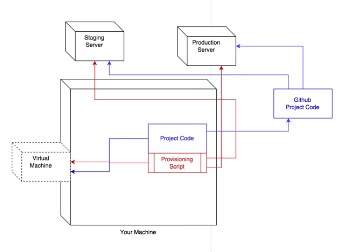
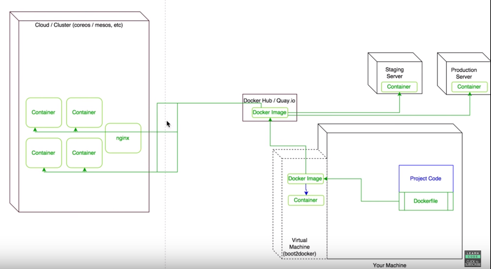

# Docker

[Docker](https://www.docker.com/)

what is the difference between vagrant and docker

vagrant
----

docker
----

boot2docker is deprecated, and [Docker Mechine](https://docs.docker.com/machine/) is good for choose.